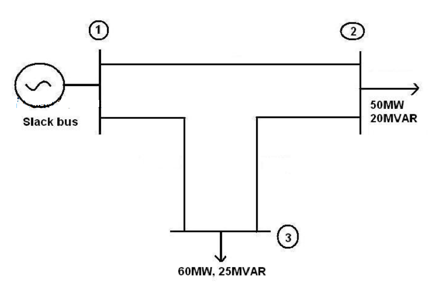
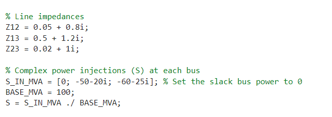
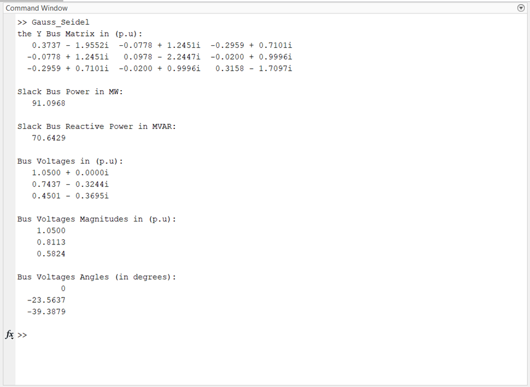

# Gauss-Seidel Load Flow Analysis for 3-Bus System

## Overview

This MATLAB code performs load flow analysis for a 3-bus power system using the Gauss-Seidel method. The load flow analysis is used to determine the steady-state voltages and phase angles at each bus in the system.

## Contents

- [Introduction](#introduction)
- [Usage](#usage)
- [Input](#input)
- [Output](#output)


## Introduction

Load flow analysis is a crucial step in power system analysis to determine the steady-state operating conditions of the system. This MATLAB code uses the Gauss-Seidel method to iteratively calculate the bus voltages and angles until convergence and the injected power at the slack bus.



## Usage

To use the code, follow these steps:

## Input



## Output



1. Open MATLAB.
2. Run the `Gauss_Seidel` function.

```matlab
Gauss_Seidel()
